# Machine Learning Editor

    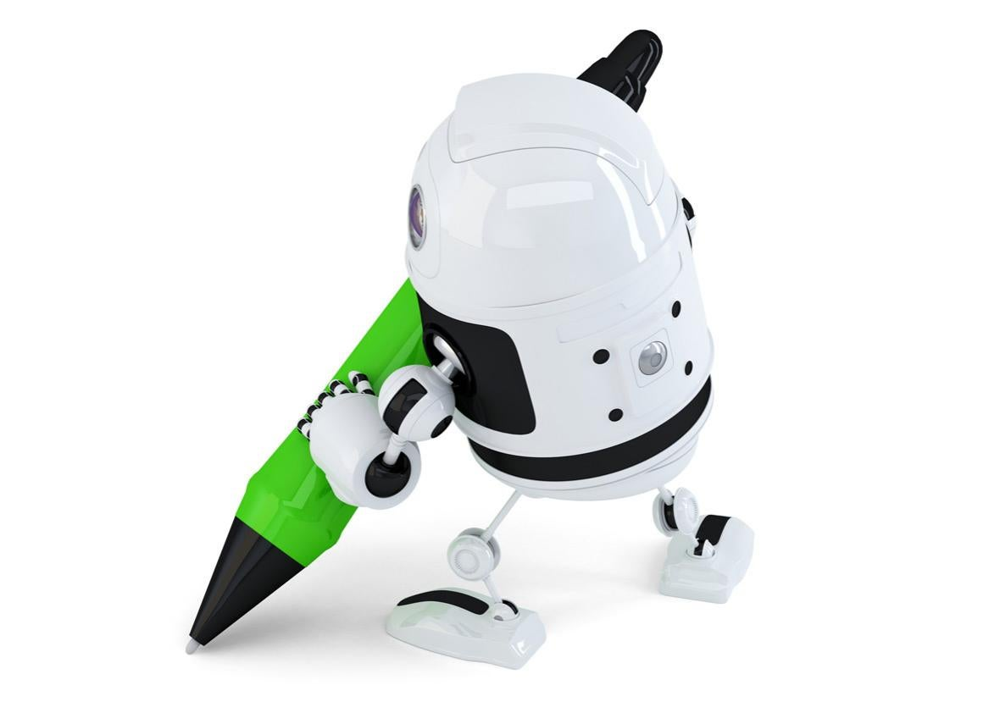

## Background:
I was fortunate enough to work with **Dr. Nihal Sahan** this past summer on a Supervised Machine Learning (ML) 
model, employing NLP techniques, that would help a startup classify business-related tweets for its app. The purpose of this model was to help automate a task performed by human editors who would manually classify tweets as "Business" or "Not Business" in the database. The resulting model is a simple, bi-grams Logistic Regression model. 

I was given access to the company's database and extracted one month's worth of business-related tweets (from May 4th, 2020 to June 4th, 2020), consisting of around 20,000 tweets. 

## Data Exploration:
After cleaning the text, I first removed any emojis after discovering these made up only 1% of the entire text population and may not prove to be helpful for my model. I employed NLP techniques on the tweets, such as Lemmatization and tokenization. 

I noticed that bi-grams provided more contextual information instead of uni-grams and a clearer distinction of different topics than tri-grams based off of the worldclouds below.

    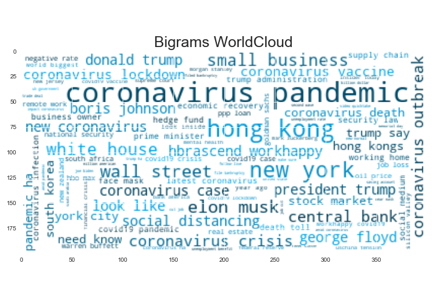
    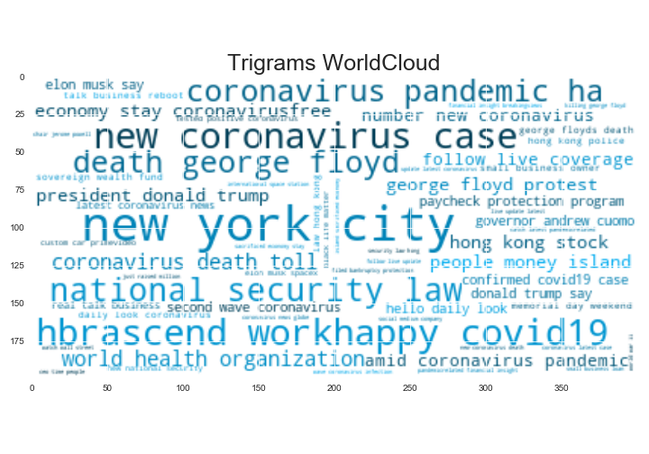

The top 10 most frequent bi-grams show the variability in topics during the month with topics ranging from Coronavirus to Elon Musk whose tweets on Coronavirus and SpacEx were hot topics during May.
https://www.bloomberg.com/news/features/2020-05-22/elon-musk-speaks-frankly-on-coronavirus-spacex-and-rage-tweets

    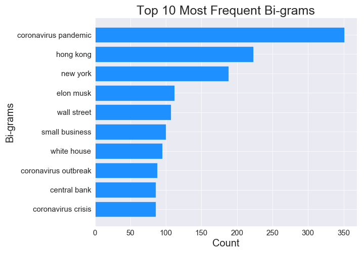

## Modelling:
When exploring the data, I observed a high class imbalance between tweets that were marked as classified correctly (98%) and those that were not (2%). Due to the significantly larger majority class, the class imbalance would result in the trained model to classify almost all future tweets as classified correctly, which needed to be rectified. I decided to go with a "balanced" class_weight hyperparameter to address this issue as the model would be penalized for misclassifying the minority class. I also tried an oversampling technique called SMOTE. See the "Twitter_Classification" python notebook for my results when using SMOTE, an oversampling method.

I created a base model, featuring unigrams, that used Logistic Regression, a "balanced" class_weight hyperparameter, and Count Vectorizer. The model performed fairly well with an AUC of 0.72, an accuracy score of 96%, and a precision and recall score of 98%. 

    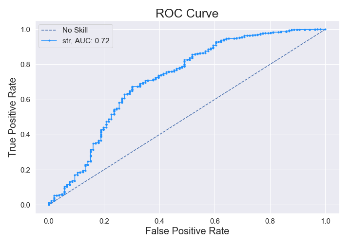
    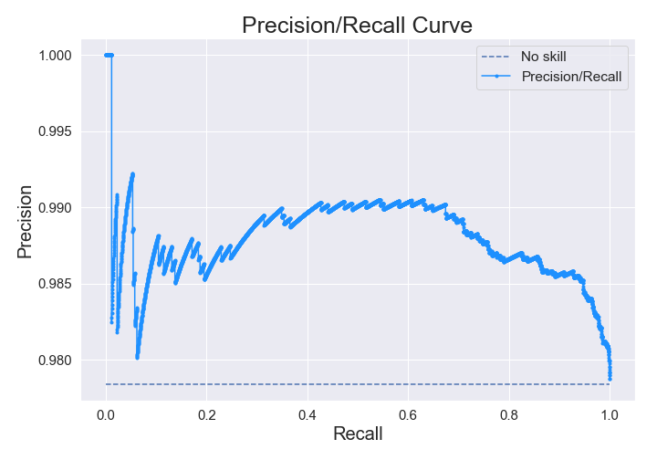
    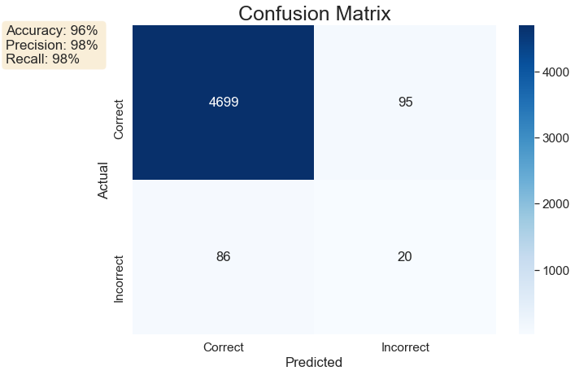

Precision was the primary metric of concern as it was imperative to minimize the number of False Positives in the model. Any tweets that came through as being classified as "Business", but weren't could be detrimental to the company as it could cause user's to question the integrity of the product and result in churn. 

## Results:
After testing different types of ML Algorithms, the best model was a Logistic Regression model with bi-grams, Term Frequency-Inverse Document Frequency (TFIDF) Vectorizer, and a "balanced" class_weight due. The Logistic Regression performed the best out of all the other ML Algorithms. It is also easily implemented, interpretabile, and has quick training time. Unlike the Count Vectorizer, the TFIDF Vectorizer normalizes the text and shows the importance of a word in a document and corpus. The final model had an AUC of 0.79, an accuracy score of 96%, and a precision and recall score of 98%. 

    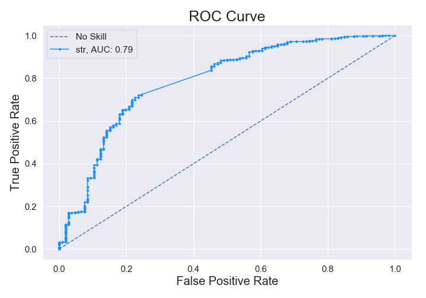
    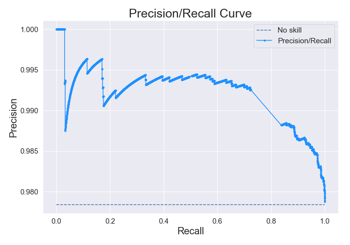

The treshold level was tweaked to see if further improvement in precision was possible. The final threshold value was increased from 0.5 to 0.8 as this resulted in the highest precision score. It's interesting to note that there was a tradeoff between precision and recall, where the precision score only marginally improved from threshold value 0.75 and up, while the recall score declined significantly.

    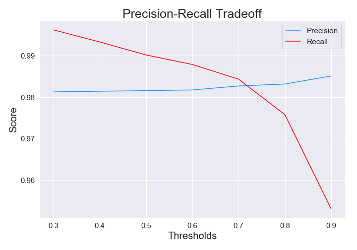

Below are the two confusion matrices with 0.5 and 0.8 thresholds, respectively.

    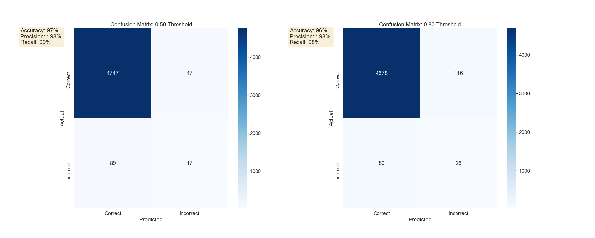

*Curious about writing to a database with AWS? Check out my article on Medium! https://medium.com/@nicole.leong27/intimidated-by-aws-dont-be-aa25a3d95b23?source=friends_link&sk=cd43068fd3fb103afe659045537208cf*

*It provides step-by-step instructions on how to write to a MongoDB database using the Twitter API.*